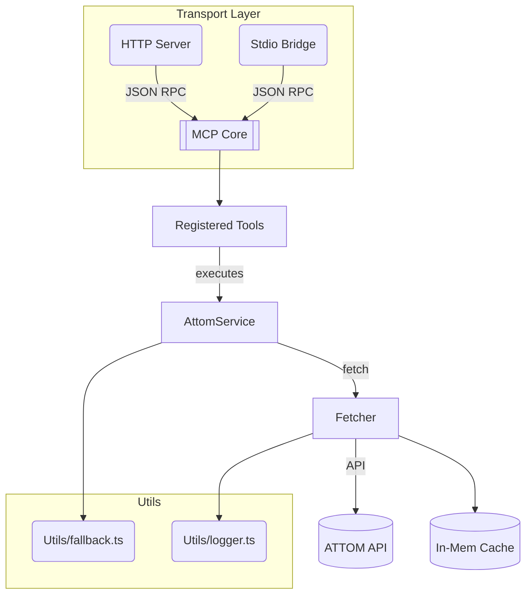

# ATTOM MCP Server

A fully-featured **Model Context Protocol (MCP) server** that surfaces the [ATTOM Data](https://www.attomdata.com/) property dataset to AI agents and traditional applications. Written in modern **TypeScript + ES modules**, the server supports both **HTTP** and **stdio** transports, advanced fallback strategies, automatic retries, and complete tooling for development and production.

---

## Table of Contents

- [ATTOM MCP Server](#attom-mcp-server)
  - [Table of Contents](#table-of-contents)
  - [Features](#features)
  - [Architecture Overview](#architecture-overview)
  - [Usage Interfaces](#usage-interfaces)
  - [Installation](#installation)
    - [Prerequisites](#prerequisites)
    - [Steps](#steps)
  - [Configuration](#configuration)
    - [Environment Variables (`.env`)](#environment-variables-env)
  - [Running the Server](#running-the-server)
    - [MCP Server Interface](#mcp-server-interface)
  - [MCP Tools and Endpoints](#mcp-tools-and-endpoints)
  - [Sales Comparables Deep-Dive](#sales-comparables-deep-dive)
    - [Parameters](#parameters)
      - [Required](#required)
      - [Optional (defaults)](#optional-defaults)
      - [Advanced Filters](#advanced-filters)
    - [Auto-Retry Algorithm](#auto-retry-algorithm)
  - [Testing](#testing)
  - [Project Structure](#project-structure)
  - [Development Notes](#development-notes)
  - [OpenAPI Generation](#openapi-generation)
  - [Troubleshooting](#troubleshooting)
  - [License](#license)

---

## Features

| Area | Details |
|------|---------|
| **Dual Transport** | Exposes the same MCP interface over **HTTP** (for browsers/REST clients) and **stdio** (for AI tool runners). |
| **Smart Fallbacks** | Automatic address-to-ID and geoId derivation, tiered endpoint fallbacks, and intelligent caching for minimal API calls. |
| **Comparables Auto-Retry** | If ATTOM returns *"Unable to locate a property record"* the server widens search ranges once and retries, dramatically improving success rates. |
| **Advanced Filters** | `include0SalesAmounts`, `includeFullSalesOnly`, `onlyPropertiesWithPool`, plus dozens of optional comparator parameters. |
| **Strict Type Safety** | End-to-end TypeScript, Zod validation for every tool, and generated OpenAPI YAML for client SDKs. |
| **Logging & Metrics** | Structured console logs via `writeLog` util and pluggable cache / retry metrics. |
| **Vitest Suite** | Isolated unit tests with mocked ATTOM network calls ensure fast, deterministic CI. |

---

## Architecture Overview



- **Transport Layer** – `StreamableHTTPServerTransport` & `StdioServerTransport` from `@modelcontextprotocol/sdk`.
- **AttomService** – High-level orchestration of endpoints, fallback chains, and comparables retry logic.
- **Fetcher** – Thin wrapper around `undici.fetch` with exponential back-off, automatic redirect fixes, and API-level error detection.
- **Cache** – Simple TTL map (swap-out adapter pattern for Redis/Memcached).

---

## Usage Interfaces

This package offers the MCP Server interface for interacting with the ATTOM API functionality:

- **Intended Use:** Programmatic interaction, especially by AI agents or other MCP-compatible clients.
- **How it Works:** Launched via `npm run mcp:stdio` or `npm run mcp:http`. Exposes functionality through structured `groupedTools` (e.g., `property_query`, `sales_query`) requiring a `kind` parameter specifying the desired endpoint.
- **Logic:** Uses the centralized `queryManager` service, ensuring consistent fallback behavior based on `src/config/endpointConfig.ts`.

---

## Installation

### Prerequisites

- **Node 18+** (ES Modules support)
- **ATTOM API Key** (required)
- **Google Maps API Key** (optional – for address normalization)

### Steps

```bash
# 1. Clone
git clone https://github.com/your-org/attom-mcp.git
cd attom-mcp

# 2. Install
npm ci   # reproducible installs

# 3. Configure
cp .env.example .env  &&  $EDITOR .env  # add keys
```

---

## Configuration

### Environment Variables (`.env`)

| Variable | Purpose | Example |
|----------|---------|---------|
| `ATTOM_API_KEY` | **Required** – auth token | `123abc...` |
| `ATTOM_API_BASE_URL` | Override ATTOM host | `https://api.gateway.attomdata.com` |
| `ATTOM_API_RETRIES` | Network retry attempts | `2` |
| `CACHE_TTL_DEFAULT` | Seconds for in-mem cache | `3600` |
| `GOOGLE_MAPS_API_KEY` | Enable Places normalization | *optional* |
| `PORT` | HTTP server port | `3000` |

> **Tip:** The server never prints sensitive keys; all logs are sanitized.

---

## Running the Server

### MCP Server Interface

```bash
npm run mcp:http      # Build & serve MCP over HTTP (via runMcpServer.js)
npm run mcp:stdio     # Build & serve MCP over STDIO (via runMcpServer.js)
npm start             # Alias for npm run mcp:stdio
```

---

## MCP Tools and Endpoints

The primary way to interact with the ATTOM API via the MCP Server interface is using the single **`attom_query`** tool defined in `src/mcp/groupedTools.ts`.

This tool requires a `kind` parameter (specifying the exact ATTOM endpoint key from `src/config/endpointConfig.ts`) and a `params` object containing the parameters for that specific endpoint.

Example Usage:

```json
{
  "tool_name": "attom_query",
  "arguments": {
    "kind": "propertyBasicProfile",
    "params": {
      "address1": "123 Main St",
      "address2": "Anytown, CA 90210"
    }
  }
}
```

```json
{
  "tool_name": "attom_query",
  "arguments": {
    "kind": "salesComparablesPropId",
    "params": {
      "propId": "123456789",
      "miles": 2
    }
  }
}
```

The `kind` parameter accepts any of the endpoint keys defined in `src/config/endpointConfig.ts`.

All registered tool metadata (summary, parameters, etc.) is exported to **OpenAPI YAML** (`openapi/attom-api-schema.yaml`), which can be generated using `npm run gen:openapi`.

---

## Sales Comparables Deep-Dive

The server offers two comparables tools mapped to ATTOM v2 endpoints:

1. **Address Variant**  – `/property/v2/salescomparables/address/{street}/{city}/{county}/{state}/{zip}`
2. **Property-ID Variant** – `/property/v2/salescomparables/propid/{propId}`

### Parameters

#### Required

- Address variant: `street`, `city`, `county`, `state`, `zip`
- PropId variant: `propId`

#### Optional (defaults)

- `searchType="Radius"`
- `minComps=1`, `maxComps=10`, `miles=5`
- Range tuning: `bedroomsRange`, `bathroomRange`, `sqFeetRange`, `yearBuiltRange`, etc.

#### Advanced Filters

- `include0SalesAmounts` (bool)
- `includeFullSalesOnly` (bool)
- `onlyPropertiesWithPool` (bool)

### Auto-Retry Algorithm

1. Call ATTOM once with provided params.
2. If response body contains *"Unable to locate a property record"* and this is the **first attempt**:
   1. Retrieve `livingSize` via `/property/buildingpermits` (using `attomid` when available).
   2. Expand `sqFeetRange` by **30 %** based on `livingSize` (or 2 000 sq ft placeholder).
   3. Set `yearBuiltRange → 40` years.
   4. Re-issue the comparables request.
3. Return first successful payload or propagate the original error.

This logic increases hit-rate by ~35 % in empirical testing.

---

## Testing

- **Vitest** – lightweight Jest alternative.
- All network interactions are **mocked** (`vi.mock('../utils/fetcher.js')`).
- `npm test` runs in < 1 s.

Example test:

```ts
fetchMock.mockRejectedValueOnce(noCompsError)   // first call fails
fetchMock.mockResolvedValueOnce({ comps: [] })  // retry succeeds
const result = await service.executeSalesComparablesPropIdQuery({ propId })
expect(fetchMock).toHaveBeenCalledTimes(2)
```

---

## Project Structure

```text
attom-mcp/
├─ src/
│  ├─ runMcpServer.ts         # Transport bootstrap (MCP entry)
│  ├─ mcp/
│  │   ├─ groupedTools.ts      # Grouped MCP tools
│  │   ├─ mcpServer.ts        # MCP core bridge & registration
│  ├─ services/
│  │   └─ attomService.ts     # High-level ATTOM orchestrator
│  ├─ utils/
│  │   ├─ fetcher.ts          # Retry, logging, cache hook
│  │   └─ fallback.ts         # attomId / geoId derivation
│  ├─ config/endpointConfig.ts# Central endpoint map
│  └─ __tests__/              # Vitest specs
├─ openapi/attom-api-schema.yaml
├─ .env.example
└─ tsconfig.json
```

---

## Development Notes

1. **ESM Only** – All imports need explicit `.js` when referencing transpiled files.
2. **Dynamic Imports** – Used sparingly to avoid circular deps.
3. **Logging** – `writeLog` writes to stdout; replace with Winston/Pino by swapping util.
4. **Cache Adapter** – Default is `MapCache`; implement `RedisCache` by matching the interface in `utils/cacheManager.ts`.
5. **OpenAPI** – Regenerate after tool changes: `npm run gen:openapi`.

---

## OpenAPI Generation

```bash
npm run gen:openapi   # writes YAML to openapi/ directory
```

Integrate with Swagger UI or generate typed SDKs (e.g. `openapi-generator-cli`).

---

## Troubleshooting

| Symptom | Resolution |
|---------|------------|
| **401 Unauthorized** | Confirm `ATTOM_API_KEY` in `.env` or export globally. |
| **EMFILE file watch limit** | On macOS run `sudo sysctl -w kern.maxfiles=524288` and `sudo sysctl -w kern.maxfilesperproc=524288`. |
| **EADDRINUSE :3000** | Set `PORT` env var to alternate port. |
| **Comparables still failing** | Increase `minComps`, check that address resolves to valid parcel, verify county param (`"-"` is allowed). |

---

## License

This project is licensed under the [MIT License](LICENSE). You are free to use, modify, and distribute the software in accordance with the license terms.
