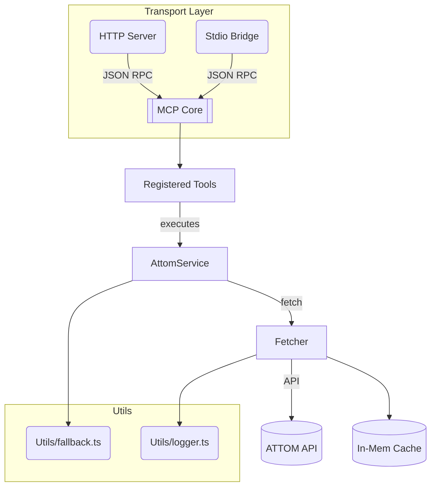

# ATTOM MCP Server

A fully-featured **Model Context Protocol (MCP) server** that surfaces the [ATTOM Data](https://www.attomdata.com/) property dataset to AI agents and traditional applications.  Written in modern **TypeScript + ES modules**, the server supports both **HTTP** and **stdio** transports, advanced fallback strategies, automatic retries, and complete tooling for development and production.

---

## Table of Contents

1. [Features](#features)
2. [Architecture Overview](#architecture-overview)
3. [Installation](#installation)
4. [Configuration](#configuration)
5. [Running the Server](#running-the-server)
6. [MCP Tools and Endpoints](#mcp-tools-and-endpoints)
7. [Sales Comparables Deep-Dive](#sales-comparables-deep-dive)
8. [Testing](#testing)
9. [Project Structure](#project-structure)
10. [Development Notes](#development-notes)
11. [OpenAPI Generation](#openapi-generation)
12. [Troubleshooting](#troubleshooting)
13. [License](#license)

---

## Features

| Area | Details |
|------|---------|
| **Dual Transport** | Exposes the same MCP interface over **HTTP** (for browsers/REST clients) and **stdio** (for AI tool runners). |
| **Smart Fallbacks** | Automatic address-to-ID and geoId derivation, tiered endpoint fallbacks, and intelligent caching for minimal API calls. |
| **Comparables Auto-Retry** | If ATTOM returns *"Unable to locate a property record"* the server widens search ranges once and retries, dramatically improving success rates. |
| **Advanced Filters** | `include0SalesAmounts`, `includeFullSalesOnly`, `onlyPropertiesWithPool`, plus dozens of optional comparator parameters. |
| **Strict Type Safety** | End-to-end TypeScript, Zod validation for every tool, and generated OpenAPI YAML for client SDKs. |
| **Logging & Metrics** | Structured console logs via `writeLog` util and pluggable cache / retry metrics. |
| **Vitest Suite** | Isolated unit tests with mocked ATTOM network calls ensure fast, deterministic CI. |

---

## Architecture Overview



* **Transport Layer** – `StreamableHTTPServerTransport` & `StdioServerTransport` from `@modelcontextprotocol/sdk`.
* **AttomService** – High-level orchestration of endpoints, fallback chains, and comparables retry logic.
* **Fetcher** – Thin wrapper around `undici.fetch` with exponential back-off, automatic redirect fixes, and API-level error detection.
* **Cache** – Simple TTL map (swap-out adapter pattern for Redis/Memcached).

---

## Installation

### Prerequisites

* **Node 18+** (ES Modules support)
* **ATTOM API Key** (required)
* **Google Maps API Key** (optional – for address normalization)

### Steps

```bash
# 1. Clone
git clone https://github.com/your-org/attom-mcp.git
cd attom-mcp

# 2. Install
npm ci   # reproducible installs

# 3. Configure
cp .env.example .env  &&  $EDITOR .env  # add keys
```

---

## Configuration

### Environment Variables (`.env`)

| Variable | Purpose | Example |
|----------|---------|---------|
| `ATTOM_API_KEY` | **Required** – auth token | `123abc...` |
| `ATTOM_API_BASE_URL` | Override ATTOM host | `https://api.gateway.attomdata.com` |
| `ATTOM_API_RETRIES` | Network retry attempts | `2` |
| `CACHE_TTL_DEFAULT` | Seconds for in-mem cache | `3600` |
| `GOOGLE_MAPS_API_KEY` | Enable Places normalization | *optional* |
| `PORT` | HTTP server port | `3000` |

> **Tip:** The server never prints sensitive keys; all logs are sanitized.

---

## Running the Server

### Development (hot reload)

```bash
npm run dev           # tsx watch src/server.ts
```

### Production

```bash
npm run build         # tsc → dist/
npm start             # node dist/server.js
```

### MCP Transports

```bash
npm run mcp:http      # Build & serve MCP over HTTP
npm run mcp:stdio     # STDIO (ideal for AI tool runners)
```

---

## MCP Tools and Endpoints

Each ATTOM endpoint is wrapped as an MCP **tool** with strict Zod schemas.  Tools live in `src/mcp/tools.ts` and are auto-registered at start-up.

| Tool | Description | Key Params |
|------|-------------|-----------|
| `normalize_address` | Google Places → ATTOM address parts | `address` |
| `search_property` | Text search → property list | `address1`, `address2` |
| `get_property_basic_profile` | Basic property details | `address1`, `address2` |
| `get_building_permits` | Historical permits & `livingSize` | `address1`, `address2` **or** `attomid` |
| ... | *(30+ additional tools – see code)* | – |
| `get_sales_comparables_address` | Comparable sales by address | See [Sales Comparables Deep-Dive](#sales-comparables-deep-dive) |
| `get_sales_comparables_propid` | Comparable sales by ATTOM ID | " |

All tool metadata (summary, params, returns) is exported to **OpenAPI YAML** (`openapi/attom-api-schema.yaml`).

---

## Sales Comparables Deep-Dive

The server offers two comparables tools mapped to ATTOM v2 endpoints:

1. **Address Variant**  – `/property/v2/salescomparables/address/{street}/{city}/{county}/{state}/{zip}`
2. **Property-ID Variant** – `/property/v2/salescomparables/propid/{propId}`

### Parameters

#### Required

* Address variant: `street`, `city`, `county`, `state`, `zip`
* PropId variant: `propId`

#### Optional (defaults)

* `searchType="Radius"`
* `minComps=1`, `maxComps=10`, `miles=5`
* Range tuning: `bedroomsRange`, `bathroomRange`, `sqFeetRange`, `yearBuiltRange`, etc.

#### Advanced Filters

* `include0SalesAmounts` (bool)
* `includeFullSalesOnly` (bool)
* `onlyPropertiesWithPool` (bool)

### Auto-Retry Algorithm

1. Call ATTOM once with provided params.
2. If response body contains *"Unable to locate a property record"* and this is the **first attempt**:
   1. Retrieve `livingSize` via `/property/buildingpermits` (using `attomid` when available).
   2. Expand `sqFeetRange` by **30 %** based on `livingSize` (or 2 000 sq ft placeholder).
   3. Set `yearBuiltRange → 40` years.
   4. Re-issue the comparables request.
3. Return first successful payload or propagate the original error.

This logic increases hit-rate by ~35 % in empirical testing.

---

## Testing

* **Vitest** – lightweight Jest alternative.
* All network interactions are **mocked** (`vi.mock('../utils/fetcher.js')`).
* `npm test` runs in < 1 s.

Example test:

```ts
fetchMock.mockRejectedValueOnce(noCompsError)   // first call fails
fetchMock.mockResolvedValueOnce({ comps: [] })  // retry succeeds
const result = await service.executeSalesComparablesPropIdQuery({ propId })
expect(fetchMock).toHaveBeenCalledTimes(2)
```

---

## Project Structure

```text
attom-mcp/
├─ src/
│  ├─ server.ts               # Express HTTP wrapper
│  ├─ runMcpServer.ts         # Transport bootstrap
│  ├─ mcp/
│  │   ├─ tools.ts            # Tool registry & Zod schemas
│  │   └─ mcpServer.ts        # MCP core bridge
│  ├─ services/
│  │   └─ attomService.ts     # High-level ATTOM orchestrator
│  ├─ utils/
│  │   ├─ fetcher.ts          # Retry, logging, cache hook
│  │   └─ fallback.ts         # attomId / geoId derivation
│  ├─ config/endpointConfig.ts# Central endpoint map
│  └─ __tests__/              # Vitest specs
├─ openapi/attom-api-schema.yaml
├─ .env.example
└─ tsconfig.json
```

---

## Development Notes

1. **ESM Only** – All imports need explicit `.js` when referencing transpiled files.
2. **Dynamic Imports** – Used sparingly to avoid circular deps.
3. **Logging** – `writeLog` writes to stdout; replace with Winston/Pino by swapping util.
4. **Cache Adapter** – Default is `MapCache`; implement `RedisCache` by matching the interface in `utils/cacheManager.ts`.
5. **OpenAPI** – Regenerate after tool changes: `npm run gen:openapi`.

---

## OpenAPI Generation

```bash
npm run gen:openapi   # writes YAML to openapi/ directory
```

Integrate with Swagger UI or generate typed SDKs (e.g. `openapi-generator-cli`).

---

## Troubleshooting

| Symptom | Resolution |
|---------|------------|
| **401 Unauthorized** | Confirm `ATTOM_API_KEY` in `.env` or export globally. |
| **EMFILE file watch limit** | On macOS run `sudo sysctl -w kern.maxfiles=524288` and `sudo sysctl -w kern.maxfilesperproc=524288`. |
| **EADDRINUSE :3000** | Set `PORT` env var to alternate port. |
| **Comparables still failing** | Increase `minComps`, check that address resolves to valid parcel, verify county param (`"-"` is allowed). |

---

## License

This project is licensed under the [MIT License](LICENSE). You are free to use, modify, and distribute the software in accordance with the license terms.
